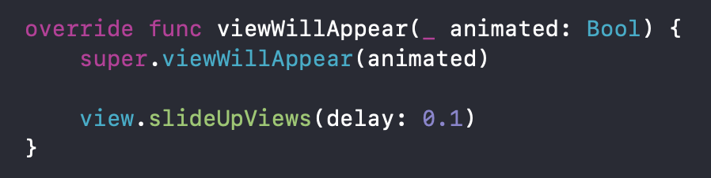

# SlideUpAnimator

Simple Swift extension to slide views in your iOS application as easiest way possible.

# Usage

1- Copy SlideUpAnimator.swift file to your project.

2- write your desired objects parent view, then call '.slideUpViews(delay: 0.1)'

Notice: the delay time is the time between appearing subviews after each other.

# Extra
Also you can use this guys:

       view.slideUpViewsQuickly(delay: 0.1) // for faster animation
       view.slideUpViewsQuickly(delay: 0.1, comple: nil) // if you want to know when animation is finished
       view.slideLeftViews(delay: 0.1) // if you want slide in views from right
       view.hideOutView() // if you want to hide out some views
       view.hideAllSubViews() // if you want to hide views in 'ViewDidLoad' then appear them later...

 Notice: 'view' that used in above exmaples could be you pranet view of objects you want to animate them.
